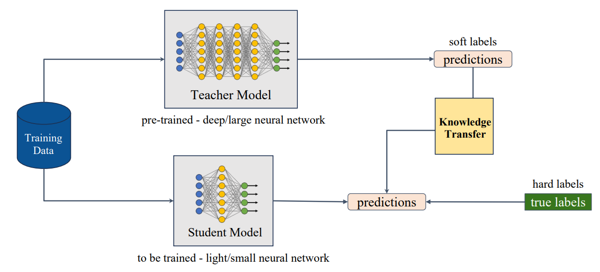
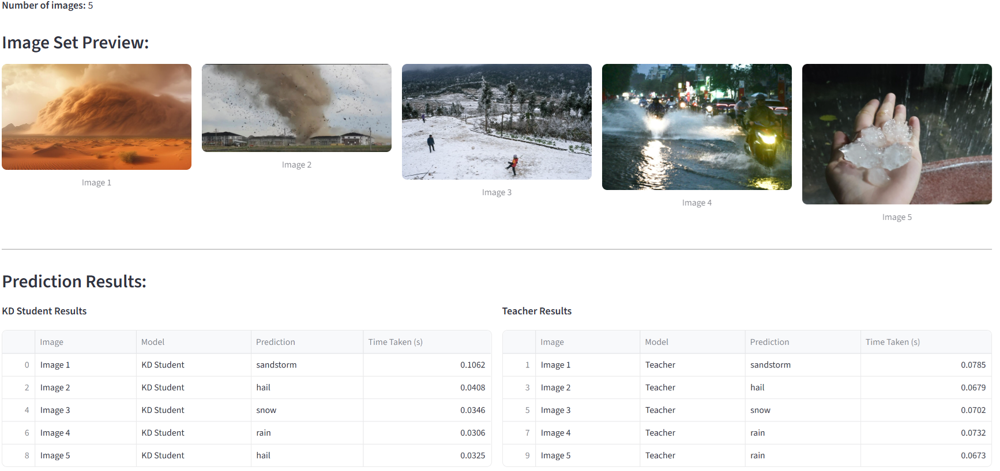
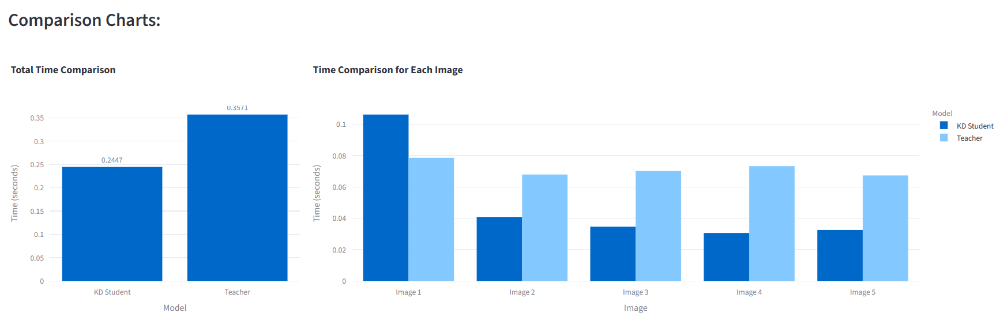

# Introduction 
This project focuses on building an intelligent system to predict various weather phenomena using image data. Leveraging deep learning techniques, we explore and compare the performance of different models, including a Knowledge Distillation (KD) approach, where a lightweight "student" model learns from a larger, more accurate "teacher" model.

Knowledge Distillation is a technique that allows transferring knowledge from large, computationally expensive
models to smaller models without losing effectiveness.



# Goal 
The main goals of the project are:

- Classify weather phenomena such as rain, snow, fog, lightning, rainbow, etc. from images.

- Implement Knowledge Distillation to create an efficient student model with high accuracy but reduced complexity.

- Provide a visual and statistical model performance comparison between the student and teacher models.

- Build an interactive Streamlit web app for uploading images and viewing prediction results.

# Why Knowledge Distillation?

Knowledge Distillation enables us to compress a large, computationally expensive model (e.g., ResNet50) into a smaller model (e.g., ResNet18), making it suitable for real-time or edge deployment without sacrificing too much accuracy.

# Features 

- Pretrained KD Student and Teacher models

- Comparison of accuracy, inference time, and predictions

- Upload or choose predefined image sets

- Powered by PyTorch and deployed with Streamlit

- Visualizations using Plotly

# Installation

To run this project, install the required dependencies listed in requirements.txt:
```bash
pip install -r requirements.txt
```

# Usage

1. Clone the repository: 
```bash
git clone https://github.com/NamNguyenWork27/Weather-Phenomena-Prediction.git
```

2. Navigate to the project directory:

```bash
cd Weather-Phenomena-Prediction
```

3. Run on local deployment:
```bash
streamlit run app.py
```

# Demo

 

